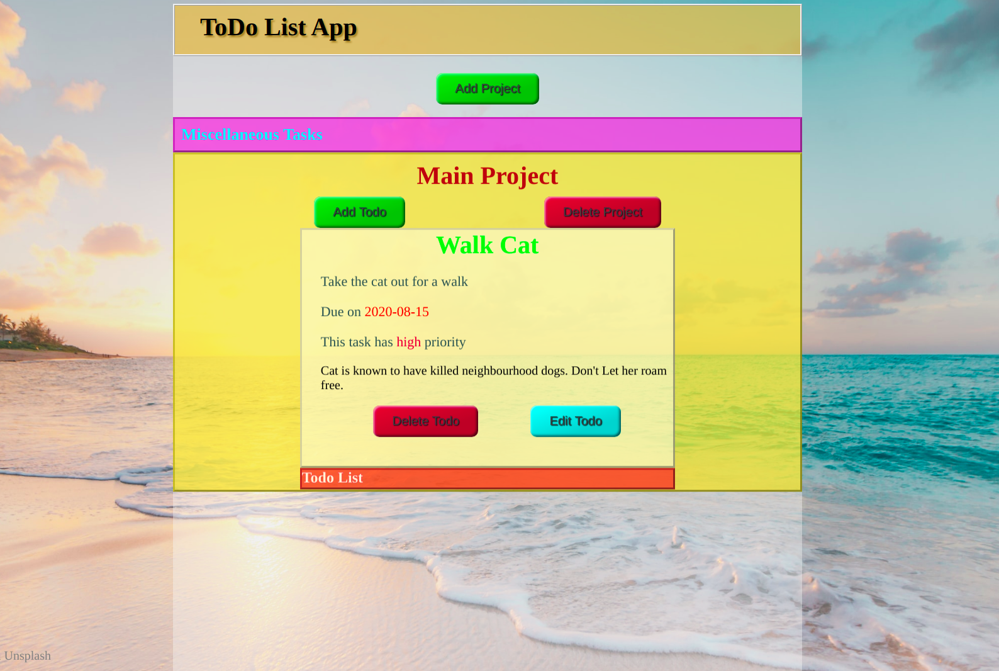

# TodoList App (JavaScript)

> A __TodoList__ app that allow users to create, edit and delete tasks, which organized into projects.

The organization of _projects_ and _todos_ is in the form of nested accordion style lists. Expand any project tab, to reveal it's tasks as well as buttons to add tasks to the project and delete the projects itself. Expand each of the revealed _todo_ tabs to edit or delete it.

## Built With

## Major languages,
- JavaScript
- HTML, CSS

## Dependencies and tools
- [Accordion](https://www.npmjs.com/package/accordion)
- npm
- webpack

## Live Demo

[Live Demo Link](https://optimistic-volhard-bc7791.netlify.app/)

## Getting Started
- Clone this repository (switch to the `feature` branch).
- Run `npm install`.
- Run `npm run start` to launch the project in the browser

### Project Navigation

- Click on any project tab ( `Pink color`) to reveal it's included tasks and the `add task` and `delete project` buttons.
- Note, you cannot delete the _Miscellaneous Tasks_ project, which is the default project.
- Click on the header ( `Brown color`) again to close it or
- Click on any task ( `Orange color`) to reveal it's details and the `delete task` and `edit task` buttons.
- Click on the Task Header ( `Green color`) again to close it.

## Authors

👤 **mbabaliiryn**

- Github: [mbabaliiryn](https://github.com/mbabaliiryn)
- Linkedin: [mbabaliiryn](https://www.linkedin.com/in/mbabali-iryn/)

👤 **Keshav Chakravarthy**

- Github: [@githubhandle](https://github.com/keshav-c)
- Linkedin: [k3shavchakravarthy ](https://www.linkedin.com/in/k3shavchakravarthy/)

## 🤝 Contributing

Contributions, issues and feature requests are welcome!

Feel free to check the [issues page](https://github.com/mbabaliiryn/TodoList/issues).

## Show your support

Give a ⭐️ if you like this project!

## Acknowledgments

- Odin project
- Accodion
- npm
- Microverse

## 📝 License

This project is [MIT](lic.url) licensed.
